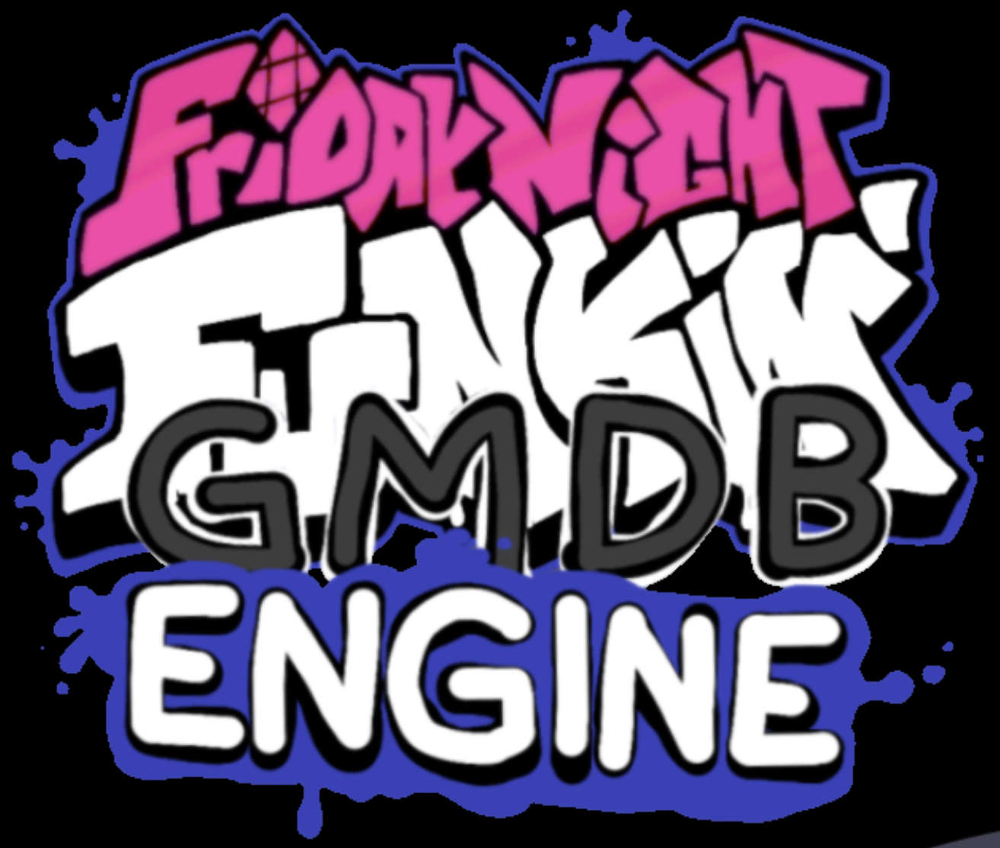

# GMDB Engine

GMDB Engine: The Fullest Rewrite of Friday Night Funkin' in funkin history

Welcome to the new GMDB Engine GitHub page! I have not done anything with the engine nor have I even started, so it's just gonna be this readme for now.
I'll try to get some programmers, playtesters, and others, but for now it's just this.
When the engine is finally done and in beta, I'll send out some downloadable/LUA releases and the source code. (Maybe some release names will be something like Beta 1, Beta 2, so on until it's finally ACTUALLY done.)

If you want the latest ideas for the engine, check this document: https://docs.google.com/document/d/13aQgEpvUhht4RBoQSPCdkNBqkokTPNTaEfTiecFeuZc/edit?usp=sharing

I'm currently accepting any commitions through this form here, if you want to apply to work on the engine: https://forms.gle/85eJKBjFruTwPEsE7

To see some Draft Art pieces, check the [engine_art](engine_art/) repository folder.

<h2>Current Jobs Available/Taken:</h2>

Programmer: Open

Co-Programmer: Open

Draft Artist: Me (taken)

Artist: Open

Co-Artist: Open

Playtester(s): Open

<h2>aight</h2>

That's all for now, see ya when the engine is complete (which is probably never)

<crap you found me>
<you won... NOTHING! Now get out!>
